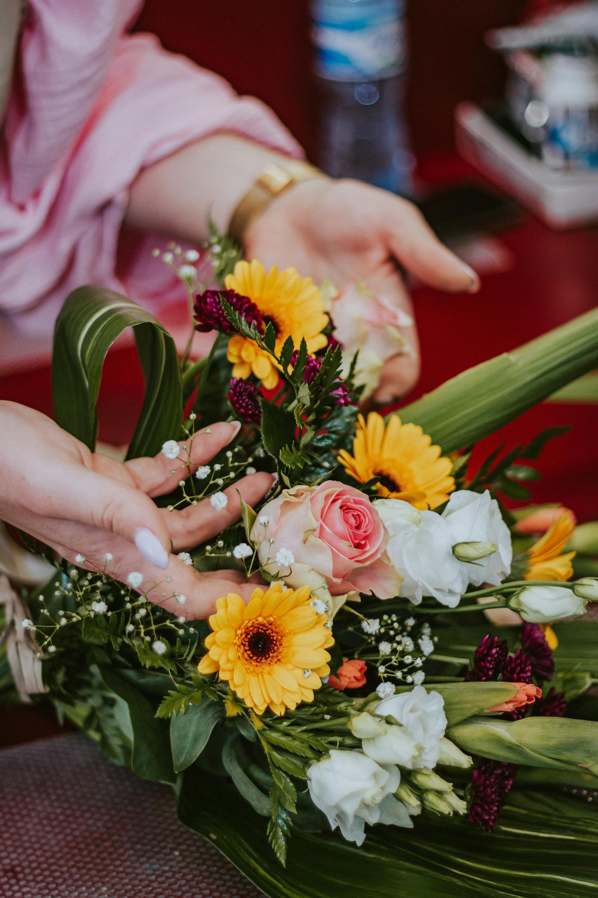

A celebration of early spring, gathered the morning of your delivery. Garden-grown blooms in soft pinks and creams, looser and more painterly than the supermarket fare you've been settling for.

## What's in it

- David Austin garden roses (5–7)
- Ranunculus, blush and white
- Astilbe and astrantia for texture
- Eucalyptus and silver foliage

## Care

Trim 2 cm off the stems on a slant, change the water every two days, keep away from direct sun and ripening fruit. Lasts 5–7 days at room temperature.
