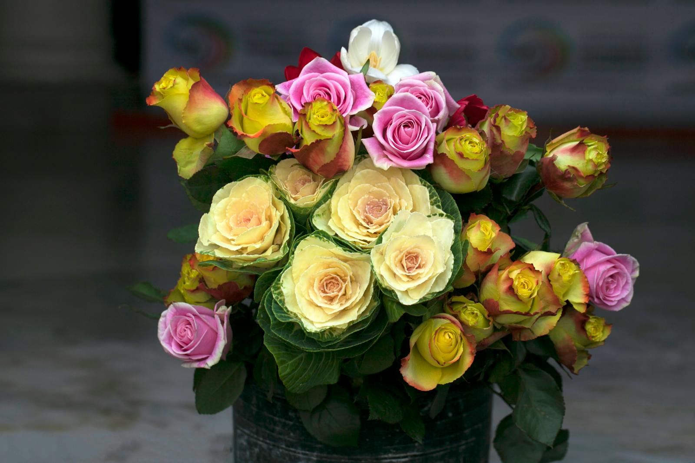

Our most-asked-for bouquet, year-round. Heavy with garden roses, scented with sweet peas and lavender, finished with whatever flowering branch is having its moment that week.

## What's in it

- Garden roses (8–10 stems, mixed colours)
- Sweet peas in cream and lilac
- Lavender for scent
- Flowering branch (apple blossom in spring, viburnum in summer)

## Care

Garden roses are the divas of the bouquet world — daily water changes, away from heat sources, and they'll reward you for a full week.
