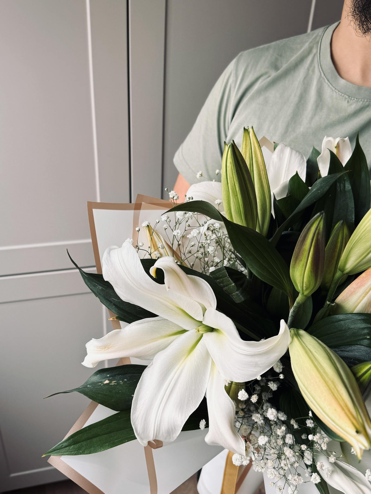

For families who find lilies too heavy. White garden roses, freesias for fragrance, lisianthus and a length of weeping eucalyptus. Less austere than lilies, still entirely respectful.

## What's in it

- White garden roses
- Freesia
- Lisianthus
- Weeping eucalyptus

## Care

Refresh water on day three, trim 1 cm off each stem.
