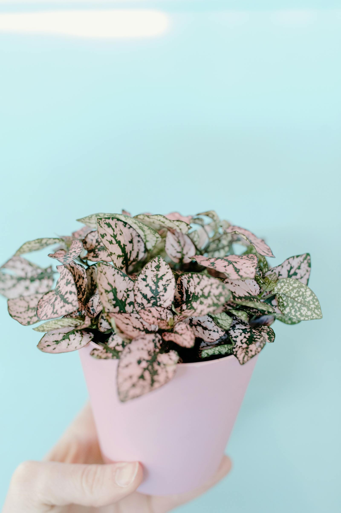

Three different species per box — a Haworthia, an Echeveria and a Sedum, varying with what's available from our growers. Tiny enough for the smallest desk, hardy enough that the recipient can ignore them.

## What's in it

- Three potted succulents (rotation of species)
- Matching terracotta or concrete pots
- Care card with watering schedule

## Care

Water sparingly — every 10–14 days in summer, once a month in winter. Bright light is non-negotiable.
