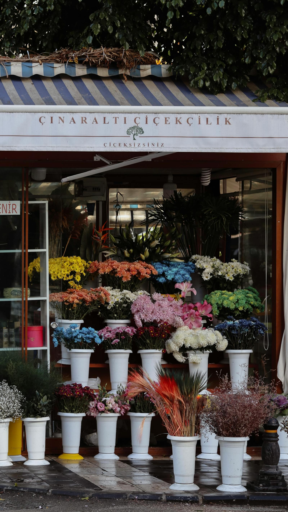
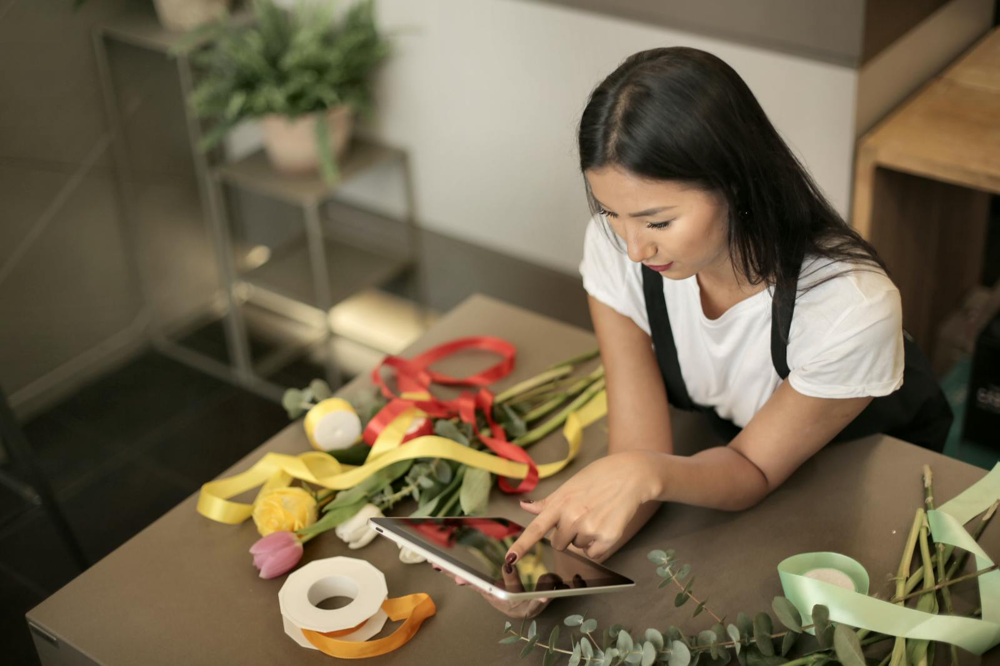
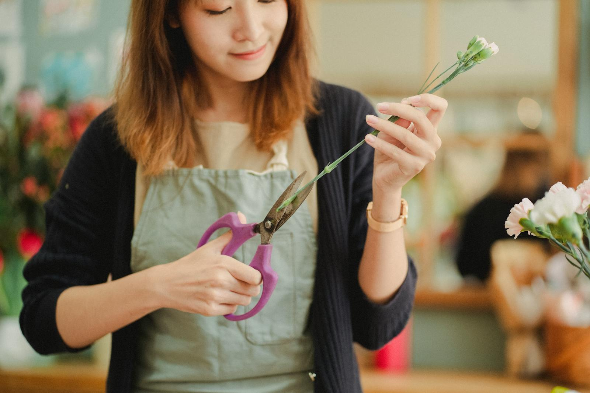
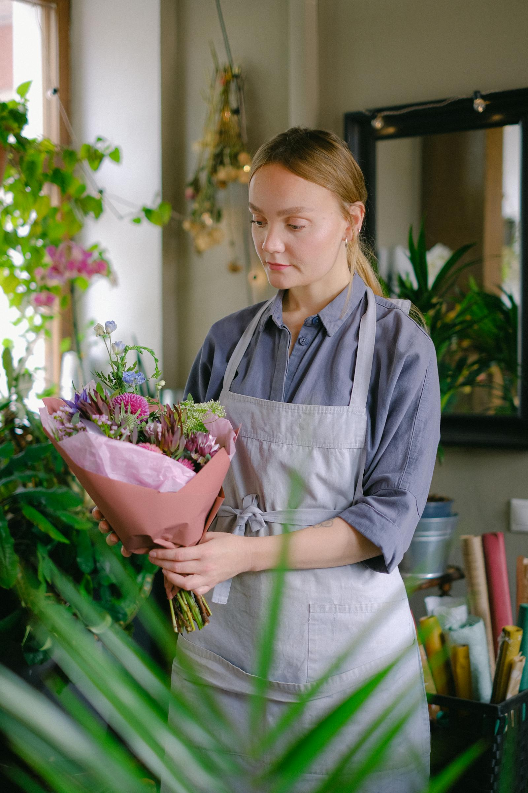

# A small shop on a quiet street

We opened ten years ago, almost by accident. Lila had been selling bouquets at the Saturday market for three winters — straight from her allotment, tied with whatever twine was nearest, written-up prices on a chalkboard. The customers kept asking where they could buy on a Tuesday. We took that as a hint.

The shop has been on the same corner ever since. Three windows, a deep counter, a back room that smells permanently of eucalyptus. We've expanded twice — once for the cold storage, once for the workshop space — and resisted every other expansion since. Smaller is better. Smaller is how we know everyone's name.

## Who works here

Three of us, full-time. Lila still does most of the floral design. Marcus runs the deliveries and learned more about cars than he ever expected to. Yuki joined two years ago from the culinary world and has the steadiest knife hand of any of us — she tackles all the wedding work now.

We're a small team, on purpose. The bouquets each get more attention because nothing's automated. The price reflects that. We're not the cheapest in town and we don't pretend to be.

## How we source

Fifty per cent of our flowers are British-grown — Cornwall, Lincolnshire, a market garden in Norfolk we visit twice a year. The rest comes through our wholesaler in New Covent Garden, almost all from European growers. We don't buy roses from Kenya or Ecuador, and we wrap nothing in plastic film. Sometimes that means we run out of red roses for Valentine's Day. We make peace with that.

## Our values, very briefly

We try not to be self-important about flowers — they're flowers, they brighten the room, they die. But here's how we run the shop:

- **Seasonal first.** What's growing now is what we sell.
- **No floral foam.** It's a microplastic that doesn't biodegrade. We use chicken wire, kenzans, and good old-fashioned hand-tying.
- **Fair pay.** Our florists are full-time employees with benefits, not freelance per-bouquet contractors.
- **Local delivery first.** We don't ship outside the UK. We don't ship internationally. We're a corner shop.
- **Quiet about it.** No crusading. We just do the work.

## Visit us

We're open Tuesday through Saturday, 9 am to 6 pm. Closed Sundays and Mondays — we go to market, rest, and live our lives. The kettle is always on. There's usually a dog asleep behind the counter.

If you'd rather order online, the [shop](/index.html) is open all night.
