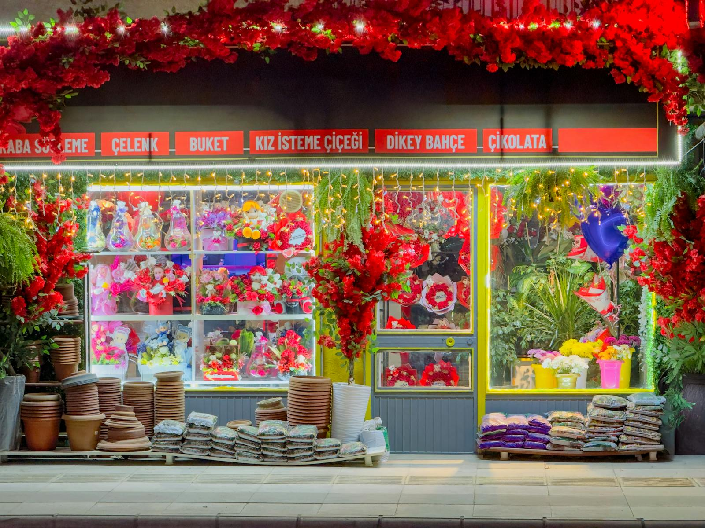

# Contact

Pick whichever channel feels easiest. We try to answer within one working day; on busy weeks (mid-May for peonies, December for amaryllis) it's sometimes two.

## The fastest paths

- **Phone** — `+44 20 7946 0000` — Tuesday to Saturday, 9 am to 6 pm.
- **Email** — `hello@example.com` — answered same-day during shop hours, next-day otherwise.
- **Walk in** — the shop is at the address below. Tea is included with every wedding consultation.

## The shop

> 47 Rosemary Lane  
> Camden Town, London NW1 7AB  
> United Kingdom

Closest tube: Camden Town (4 minutes' walk).

We're a working studio as well as a shop, so the space is sometimes cluttered with floral debris. If you're stopping by for a wedding consultation, the table at the back is where we sit and sketch — phone ahead so we can clear it.

## Opening hours

| Day | Hours |
|---|---|
| Monday | Closed |
| Tuesday | 9:00 — 18:00 |
| Wednesday | 9:00 — 18:00 |
| Thursday | 9:00 — 18:00 |
| Friday | 9:00 — 19:00 |
| Saturday | 9:00 — 18:00 |
| Sunday | Closed |

We close two weeks a year — the first week of August (Lila's holiday) and the week between Christmas and New Year. Subscriptions pause automatically.

## Wedding & event enquiries

Email is best for these — we'll reply with a short questionnaire about the date, venue, palette and budget. Bookings open 12 months in advance. We take on roughly two weddings a month from May to October to keep the work careful.

## Press, partnerships, weird requests

Email `press@example.com`. We're slow to answer but we read everything.

## Returns and complaints

If a delivery arrived in a bad state, take a photo and send it within 24 hours. We re-make and re-deliver, no quibbling. The flowers are perishable — we know that and so do you. We'd rather make it right than argue about it.
