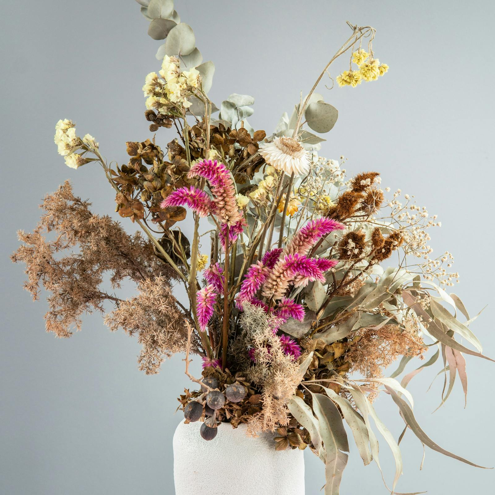
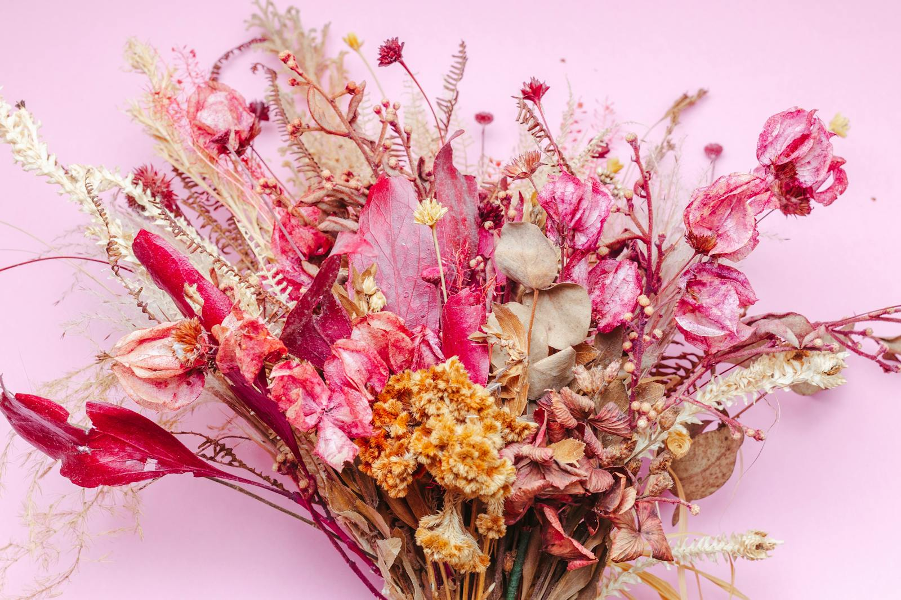
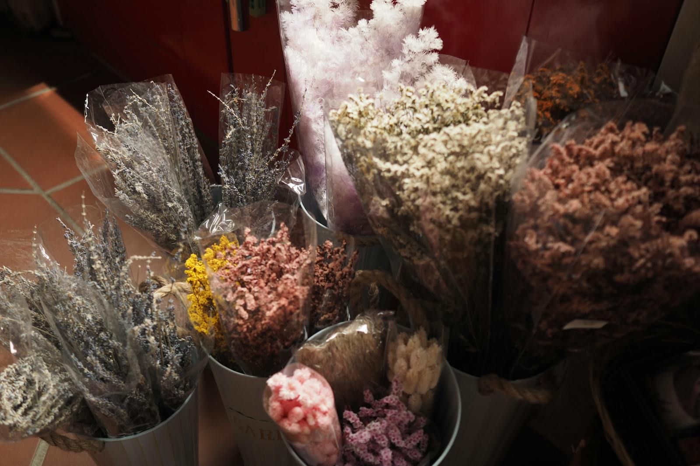

# Everlasting

Dried flowers used to be the consolation prize. The leftover. The thing you accepted because the fresh stuff was too expensive or wasn't in season. We've changed our mind. The right dried bouquet, made from properly preserved stems, is its own kind of beautiful — quieter, dustier, more subtle than fresh, and quite happy in a corner where natural light is scarce.

## Why we make them

Fresh flowers are perishable. That's part of the appeal — the brief, generous gesture. But a dried arrangement does different work: it lives in the room for a year or two, it doesn't need water, it doesn't suffer when you go on holiday. Three reasons we lean into them more each season:

- **They use blooms at their peak.** We dry roses, peonies, hydrangeas, and grasses when they're at their best — not when they've gone over. The colour you see in the dried arrangement is the colour they had on day three of vase life.
- **They travel well.** A dried bouquet survives a courier in a box; a fresh one is anxious by the second day in transit.
- **They're forgiving for renters and travellers.** No watering. No light requirements (most of them). Pet-safe (most of them).

## The process

We dry our own. Bunches go into the workshop's dry cupboard — dark, dry, with airflow — for two weeks minimum. Some flowers (delphiniums, larkspur) keep nearly all their colour. Others (roses, peonies) shift toward muted, dustier versions of themselves. We don't bleach. We don't dye. The colour palette of a dried bouquet is the limit of what nature gave us, and we like the constraint.

A handful of varieties get the silica treatment instead — peonies that need to keep their shape, hydrangeas in particular. Slower, more delicate, but the result is closer to the original bloom.

## How long they last

In a normal living room, away from direct sunlight: **two to three years**. In a sun-drenched window: maybe one. In a steamy bathroom: don't.

When they're done, compost them. They're plant matter — they belong back in the soil.

## What we make

We don't list dried bouquets in the regular [shop](/index.html) because they're built to order, slowly, in batches. Get in touch via [contact](/contact.html) and tell us:

- The size of the room
- The light situation
- Your palette preference (warm dusty / cool sage / monochrome cream)
- Your budget (start at £45, no upper limit)

We'll send a sketch and a quote within a week.
