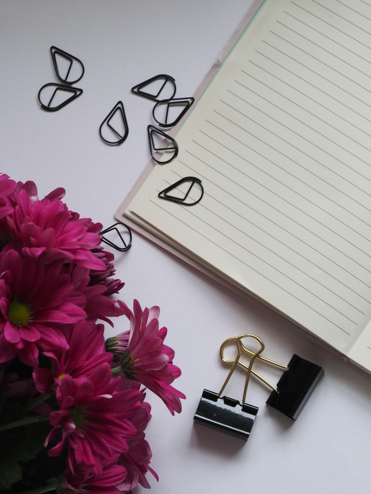

# Cultivating a meaningful life

The journal is where we write longer than an Instagram caption and shorter than a book. Some entries are practical — how to keep tulips upright, why we don't bleach our dried flowers. Others are quieter: the daily act of choosing flowers as a small ritual; what living slowly actually looks like inside a small business; the discipline of a shop that closes Sundays and Mondays.

We don't post on a schedule. We post when there's something worth saying.

## What you'll find here

Three rough flavours of writing:

### Practical notes from the shop

How-to pieces. *Why your hydrangeas droop, and the trick that revives them in twenty minutes. How to tell a peony at peak from a peony past it. The five common mistakes that kill orchids — and the one habit that saves them.*

### Reflections on slow living

Less practical, more meandering. *The case for making a Wednesday-afternoon ritual out of unwrapping a bouquet. What ten years of running a small shop taught us about working hours. Why we close on Mondays and won't apologise.*

### Stories from the makers

The grower in Cornwall who taught us about peonies. The Norfolk market garden that fields five varieties of cosmos. Notes from a once-a-year visit to our wholesaler in New Covent Garden at 4 a.m.

## Subscribing

The journal is also available as an email newsletter — once or twice a month, from a real human. No tracking, no upselling, no "marketing automation". Sign up via the [contact form](/contact.html) and ask to be added.

## A note on the title

"Cultivating a meaningful life" is a phrase Lila wrote on the shop's first business plan, ten years ago. We embarrassed ourselves with it for years and then realised we couldn't think of anything more honest. The work is to grow something — flowers, a business, a habit, a relationship — slowly and with care. The phrase is, by now, the closest thing we have to a manifesto.

---

*New entries appear on the [home page](/index.html) under the journal section. The full list is below — once we've published a few.*
