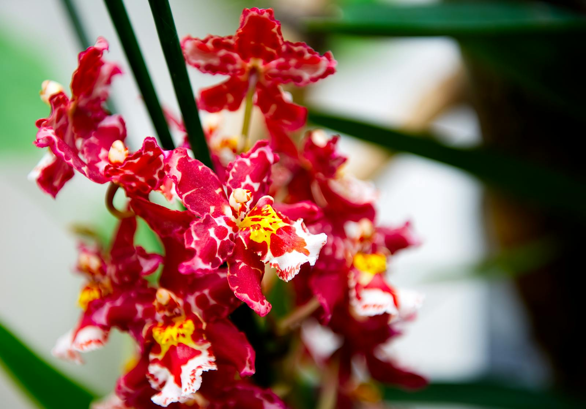

# Rare & unusual

Once a month we set aside a corner of the shop for plants that aren't in the everyday range. Some are seasonal — tulip species you only see for two weeks in March, fritillaries that arrive and leave in a fortnight. Others are quiet rare-plant finds from our friends at a specialist nursery in the Cotswolds: paphiopedilum slipper orchids, jewel orchids, *Tillandsia* species you can't keep in soil.

The list rotates. Stock is small, often single-piece. When it's gone, we don't restock.

## Why we do it

Mostly because the team gets to play. A florist has a boring week if the only flowers are the same six varieties every supermarket also stocks. The rare-and-unusual rotation keeps the workshop interesting and brings in customers who'd otherwise drive to the city for a specialist. Some of them stick around for the everyday work too.

## What's currently in the rotation

We update this list at the start of each month. A snapshot of what's been on the shelf recently:

- **Paphiopedilum** slipper orchids (multiple species, depending on the Cotswolds nursery's stock)
- **Hoya** in unusual variegated cultivars
- **Echeveria gibbiflora** in dramatic blue-grey rosettes
- **Jewel orchids** (*Ludisia discolor*) for the people who want orchids without the flowers
- **Cyclamen** species (the wild forms, not the supermarket hybrids)
- **Spring fritillaries** when they're about (mid-March, two weeks)
- **Magnolia stellata** branches in early March

If something specific is on your wishlist, [get in touch](/contact.html) — we'll keep an eye out the next time we visit our suppliers.

## Care notes

These aren't beginner plants — that's the point. Most need specific light, humidity, or watering routines. Each one ships with a printed care card written for the species you're getting (not a generic "houseplant" guide). We'll also stay in touch by email for the first six weeks and answer questions you didn't know you'd have.

## Pricing

Rare doesn't always mean expensive. Some species are £25; others are £180. The price reflects scarcity at our supplier, not artificial markup. We tell you on the card where each plant came from.

## Reservations

We hold rare-stock items by deposit (£20, refundable against the purchase) for up to seven days. Most regulars phone the shop on a Tuesday morning when the new month's rotation arrives.
