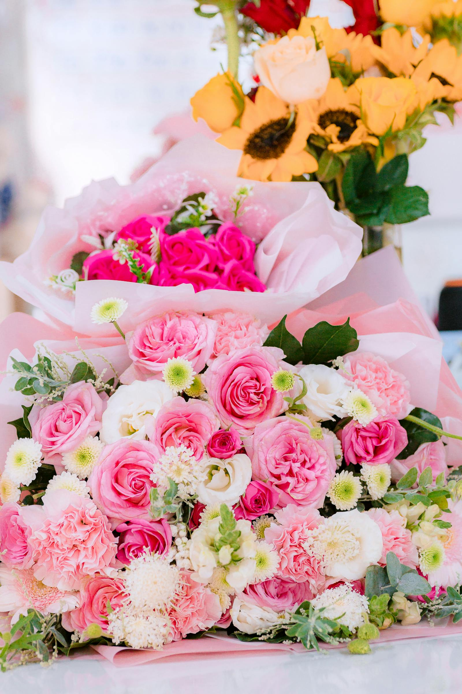
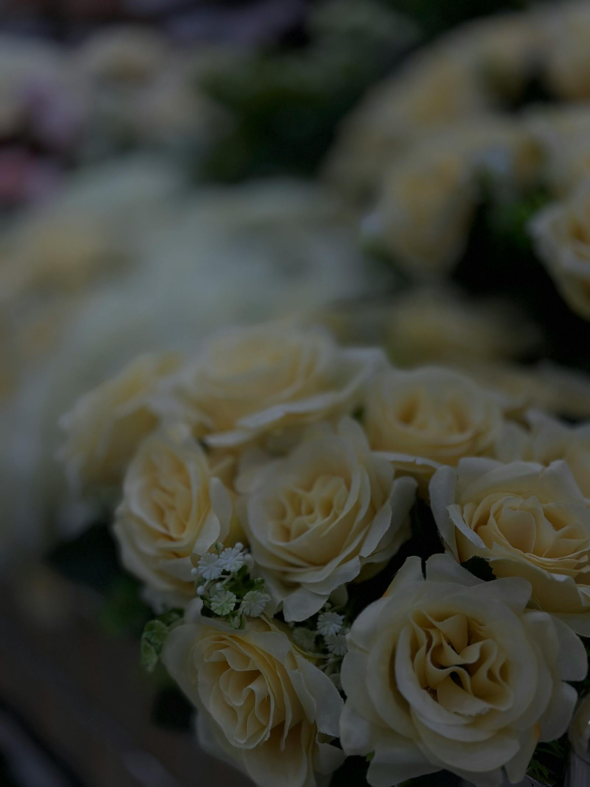

# Seasonal blooms

Most of our bouquets are built around what's flowering in British fields and Dutch greenhouses **this week**. Not what was flowering when we ordered, not what was flowering last month — this week. That's the difference between a flower shop that goes to market on Monday morning and one that ships from a warehouse.

## What that means in practice

Two weeks of every year, we have peonies that look like they've been stolen from a Dutch still life. Two months later, dahlias the size of a coffee saucer. Six weeks after that, the chrysanthemums show up — which sounds dull until you see the heirloom varieties and realise you've never actually met a chrysanthemum.

In between: the boring weeks. The bridge season. The "everything-is-tulips-and-we're-tired-of-tulips" weeks. Those are the weeks we lean hardest on greenery and cleverness.

## A rough calendar

| Month | What we're excited about |
|---|---|
| **January** | Hellebores, paperwhites, forced ranunculus, hyacinths |
| **February** | Anemones, tulips (every variety), early daffodils |
| **March** | Daffodils everywhere, cherry blossom branches, fritillaries |
| **April** | Tulips peak, hellebores fade, magnolia branches |
| **May** | **Peonies arrive.** Sweet peas. Lily of the valley. |
| **June** | Garden roses peak. Foxgloves, sweet williams. |
| **July** | Cosmos, scabiosa, summer dahlias begin |
| **August** | Dahlias peak, sunflowers, late roses |
| **September** | Dahlias still going strong, asters, autumn berries |
| **October** | Chrysanthemums, last dahlias, foliage turns |
| **November** | Heirloom chrysanthemums, hellebores return |
| **December** | Anemones, tulips, evergreens, amaryllis |

## Why we don't sell out-of-season tropicals

You won't find peonies in our shop in October. You can find them in some shops — flown in from Chile or Alaska where the season is offset — but the carbon cost is steep and the flowers, frankly, look tired. We'd rather wait six months for a stem we believe in.

The exception is wedding work where the couple has their hearts set on a specific bloom. We'll source it (and tell you what it costs and where it came from) but we won't pretend it grew up the road.

## What's in this week

We update our [shop](/index.html) every Monday morning with the bouquets we've built around that week's market. You'll often spot one or two **Limited** badges — those are the once-a-year stems we won't have for long.

Sign up to our [Floral rituals](/subscriptions.html) subscription and the calendar comes to your kitchen table without you having to remember.
